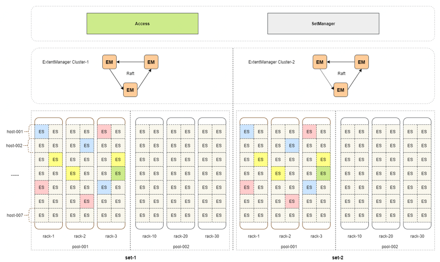

# cyprestore
自研高性能分布式存储引擎Cypress Store.
## 架构简介


<center>*Cyprestore单数据中心集群架构图*</center>

# 开发环境搭建
## 1 项目源码
### 1.1 克隆源码
```sh
mkdir workspace && cd workspace  
git clone https://github.com/yangcx000/cyprestore.git  
cd cyprestore && git submodule update --init --recursive  
```

## 1.2 第三方依赖 
| 第三方依赖 | repo地址 | 版本 |
| ------ | ------ | ------ |
| brpc | [https://github.com/apache/incubator-brpc.git] | tags/0.9.7 |
| rocksdb | [https://github.com/facebook/rocksdb.git] | tags/v6.13.3 |
| spdk | [https://github.com/spdk/spdk.git] | tags/v20.04.1 |

## 2 编译器版本
为了使用C++11，GCC-C++版本至少4.8+。

## 3 安装依赖库
### 3.1 brpc依赖库
```sh
sudo yum -y install openssl-devel gflags-devel protobuf-devel protobuf-compiler leveldb-devel gperftools-devel gtest-devel
```

### 3.2 rocksdb依赖库
```sh
sudo yum -y install snappy snappy-devel  
sudo yum -y install zlib zlib-devel  
sudo yum -y install bzip2 bzip2-devel  
sudo yum -y install lz4-devel   
sudo yum -y install libasan  
sudo yum -y install gflags gflags-devel  
```

### 3.3 spdk依赖库
```sh
cd third-party/spdk && ./scripts/pkgdep.sh
```

## 4 编译
### 4.1 brpc
```sh
cd third-party/brpc  
git checkout -b cyprestore-v0.9.7 tags/0.9.7  
mkdir build && cd build && cmake .. && make -j8  
```

### 4.2 rocksdb
```sh
cd third-party/rocksdb   
git checkout -b cyprestore-v6.13.3 tags/v6.13.3  
```
- 编译静态库(推荐)  
```sh
make static_lib -j8
```
- 编译动态库(可选)  
```sh
make shared_lib -j8
```

*注意：用于生产环境，不要直接使用make或者make all编译成性能较差的debug模式。*

### 4.3 spdk
```sh
cd third-party/spdk  
git checkout -b ccyprestore-v20.04.1 tags/v20.04.1  
```
- 编译静态库(推荐)  
```sh
./configure  
make -j8  
```
- 编译动态库(可选)  
```sh
./configure --with-shared   
make -j8  
ldconfig -v -n ./build/lib  
LD_LIBRARY_PATH=./build/lib/:./dpdk/build/lib/ ./build/bin/spdk_tgt  
```
### 4.4 cyprestore
```sh
./compile.sh all
```
