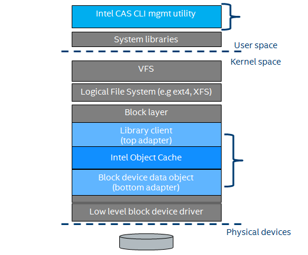
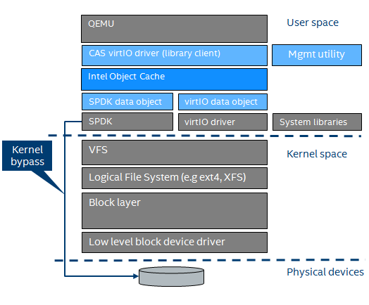
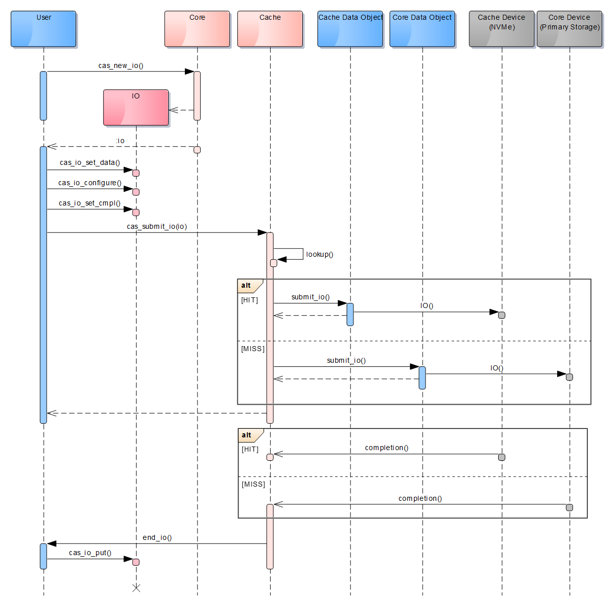

# Open CAS Framework

# Content:
- [Architecture overview](#architecture-overview)
- [Management interface](#library-management)
- [IO path](#reading-and-writing-data)

# Architecture overview

Intel(R) Cache Acceleration Software (CAS) consists of:
- Platform independent library called Open CAS Framework (OCF)
- Platform dependent adaptation layers enabling OCF to work in different
environments such as Linux kernel

An example usage for OCF is Linux kernel (see picture below).
In this case OCF operates as block level cache for block devices.
For this usage model OCF comes with following adaptation layers:
- <b>Library client (top adapter)</b> - its main responsibility is creating
cache volume representing primary storage device. Application can
read/write from/to the cache volume block device as to regular primary
storage device.
- <b>Block device volume (bottom adapter)</b> - is responsible for issuing
IO operations to underlying block device.

A system administrator can manage cache instances via Intel CAS CLI management
utility called "casadm".



Another example of OCF usage is user space block level cache for QEMU
(see picture below). In this example following adaptation layers may exist:
- <b>CAS virtIO-blk driver for QEMU (top adapter)</b> - it exposes
primary storage device (another virtIO driver) to guest OS via OCF library
- <b>virtIO-blk volume (bottom adapter)</b> - enables OCF to access
data on primary storage device or cache device via original virtIO driver

Please note that actual adapters depend on the environment where OCF is
meant to be run. There can be different bottom adapters delivered for cache device
and primary storage device. For example bottom adapter for caching device may
be implemented using kernel bypass techniques, providing low-latency access to
cache media.



# Management interface
Management interface delivered with Intel OCF enables system administrator to:
 - Configure OCF caching library to target environment, which includes installation
of required platform dependent adapters.
 - Starting/stopping and managing existing cache instances.
 - Performing observability functions (e.g. retrieving performance counters)

For more details please see below examples:

## Library initialization example

OCF enables possibility use it simultaneously from two independent libraries linked
into the same executable by means of concept of contexts. Each context has its own
set of operations which allow to handle specific data types used by volumes
within this context.

```c
#include "ocf.h"

/* Handle to library context */
ocf_ctx_t ctx;

/* Your context interface */
const struct ocf_ctx_ops ctx_ops = {
/* Fill your interface functions */
};

/* Your unique volume type IDs */
enum my_volume_type {
	my_volume_type_1,
	my_volume_type_2
};

/* Your volumes interface declaration */
const struct ocf_volume_ops my_volume_ops1 = {
	.name = "My volume 1",
	/* Fill your volume interface functions */
};

const struct ocf_volume_ops my_volume_ops2 = {
	.name = "My volume 2"
	/* Fill your volume interface functions */
};

int my_cache_init(void)
{
	int result;

	result = ocf_ctx_create(&ctx, &ctx_ops)
	if (result) {
		/* Cannot initialze context of OCF library */
		return result;
	}
	/* Initialization successful */

	/* Now we can register volumes */
	result |= ocf_ctx_register_volume_ops(ctx, &my_volume_ops1,
			my_volume_type_1);
	if (result) {
		/* Cannot register volume interface */
		goto err;
	}

	result |= ocf_ctx_register_volume_ops(ctx, &my_volume_ops2,
			my_volume_type_2);
	if (result) {
		/* Cannot register volume interface */
		goto err;
	}

	return 0;

err:
	/* In case of failure we destroy context and propagate error code */
	ocf_ctx_put(ctx);
	return result;
}

```

## Cache management
OCF library API provides management functions (@ref ocf_mngt.h). This
interface enables user to manage cache instances. Examples:
- Start cache
```c
int result;
ocf_cache_t cache; /* Handle to your cache */
struct ocf_mngt_cache_config cfg; /* Your cache configuration */

/* Prepare your cache configuration */

/* Configure cache mode */
cfg.cache_mode = ocf_cache_mode_wt;

/* Now tell how your cache will be initialzed. Selech warm or cold cache */
cfg.init_mode = ocf_init_mode_init;

cfg.uuid.data = "/path/to/your/cache/or/unique/id";

/* Specify cache volume type */
cfg.volume_type = my_volume_type_1;

/* Other cache configuration */
...

/* Start cache. */
result = ocf_mngt_cache_start(cas, &cache, cfg);
if (!result) {
	/* Your cache was created successfully */
}
```

- Add core (primary storage device) to cache
```c
int result;
ocf_core_t core;  /* Handle to your core */
struct ocf_mngt_core_config cfg; /* Your core configuration */

/* Prepare core configuration */

/* Select core volume type */
cfg.volume_type = my_volume_type_2;
/* Set UUID or path of your core */
cfg.uuid.data = "/path/to/your/core/or/unique/id";

result = ocf_mngt_cache_add_core(cache, &core, &cfg);
if (!result) {
	/* Your core was added successfully */
}

```

## Management interface considerations
Each device (cache or core) is assigned with ID, either automatically by OCF or
explicitly specified by user. It is possible to retrieve handle to cache
instance via @ref ocf_cache_get_id. To get handle to core instance please
use @ref ocf_core_get_id.

Cache management operations are thread safe - it is possible to perform
cache management from many threads at a time. There is a possiblity to "batch"
several cache management operations and execute them under cache management
lock. To do this user needs to first obtain cache management lock, perform management
operations and finally release the lock. For reference see example below.

```c
int my_complex_work(ocf_cache_id_t cache_id,
		ocf_core_id_t core_id)
{
	int result;
	ocf_cache_t cache; /* Handle to your cache */
	ocf_core_t core; /* Handle to your core */

	/* Get cache handle */
	result = ocf_mngt_cache_get(cas, cache_id, &cache);
	if (result)
		return result;

	/* Lock cache */
	result = ocf_mngt_cache_lock(cache);
	if (result) {
		ocf_mngt_cache_put(cache);
		return result;
	}

	/* Get core handle */
	result = ocf_core_get(cache, core_id, &core);
	if (result) {
		result = -1;
		goto END;
	}

	/* Cache is locked, you can perform your activities */

	/* 1. Flush your core */
	result = ocf_mngt_core_flush(cache, core_id, true);
	if (result) {
		goto END;
	}

	/* 2. Your others operations including internal actions */

	/* 3. Removing core form cache */
	result = ocf_mngt_cache_remove_core(cache, core_id, true);

END:
	ocf_mngt_cache_unlock(cache); /* Remember to unlock cache */
	ocf_mngt_cache_put(cache); /* Release cache referance */

	return result;
}
```

# IO path
Please refer to below sequence diagram for detailed IO flow. Typical IO
path includes:
 - <b>IO allocation</b> - creating new IO instance that will be submitted to OCF
for processing
 - <b>IO configuration</b> - specifying address and length, IO class, flags and
completion function
 - <b>IO submission</b> - actual IO submission to OCF. OCF will perform cache
lookup and based on its results will return data from cache or primary
storage device
 - <b>IO completion</b> - is signalled by calling completion function specified
in IO configuration phase



## IO submission example
```c
#include "ocf.h"

void read_end(struct ocf_io *io, int error)
{
	/* Your IO has been finished. Check the result and inform upper
	 * layers.
	 */

	/* Release IO */
	ocf_io_put(io);
}

int read(ocf_core_t core, ocf_queue_t queue, void *data, addr, uint32_t length)
{
	/* Allocate IO */
	struct ocf_io *io;

	io = ocf_core_new_io(core, queue, addr, length, OCF_READ, 0, 0);
	if (!io) {
		/* Cannot allocate IO */
		return -ENOMEM;
	}

	/* Set completion context and function */
	ocf_io_set_cmpl(io, NULL, NULL, read_end);

	/* Set data */
	if (ocf_io_set_data(io, data, 0)) {
		ocf_io_put(io);
		return -EINVAL;
	}

	/* Send IO requests to the cache */
	ocf_core_submit_io(io);

	/* Just it */
	return 0;
}
```
